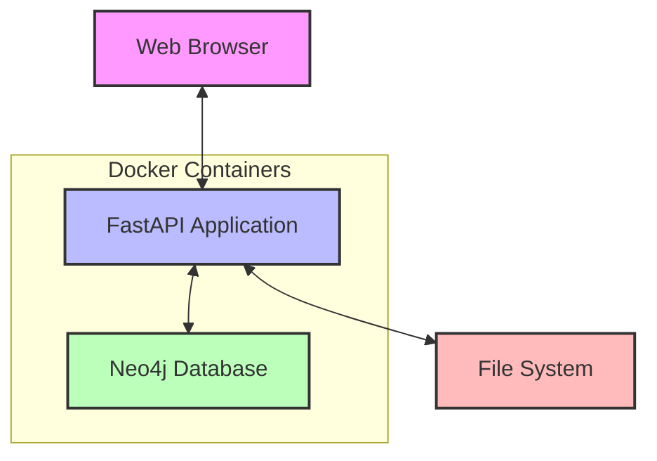
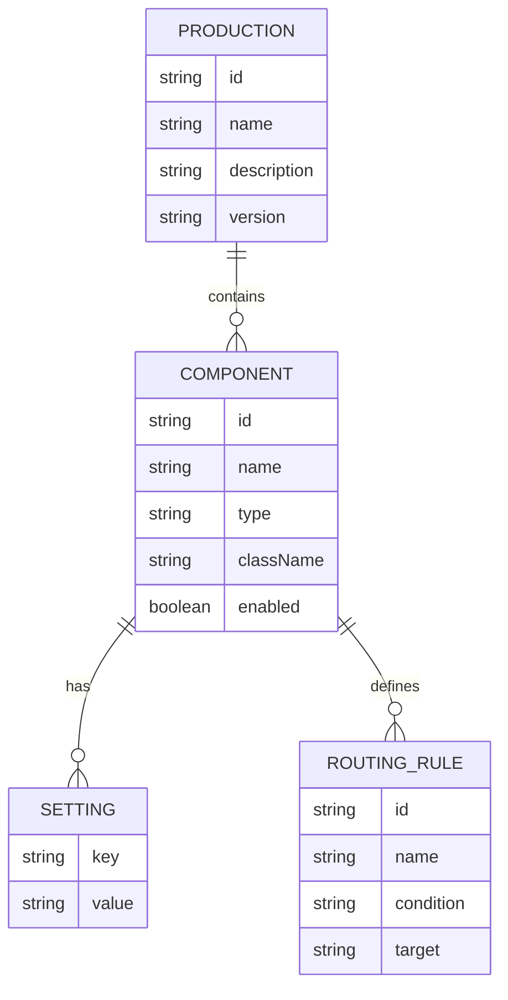

# Neo4j IRIS Project: Design and Implementation

## Table of Contents
1. [Overview](#overview)
2. [System Architecture](#system-architecture)
3. [Data Model](#data-model)
4. [Component Details](#component-details)
5. [API Endpoints](#api-endpoints)
6. [Visualization](#visualization)
7. [Deployment](#deployment)
8. [Usage Guide](#usage-guide)
9. [Troubleshooting](#troubleshooting)

## Overview

The Neo4j IRIS project is designed to import, visualize, and analyze InterSystems IRIS HealthConnect production configurations using a graph database. It provides a web-based interface for exploring complex healthcare integration scenarios.

## System Architecture



### Key Components

1. **Frontend**
   - Interactive web interface
   - Built with HTML, JavaScript, and vis.js
   - Responsive design for different screen sizes

2. **Backend**
   - FastAPI application
   - Handles file uploads and processing
   - Manages database interactions
   - Serves the web interface and API endpoints

3. **Database**
   - Neo4j graph database
   - Stores production configurations as nodes and relationships
   - Enables complex graph queries

## Data Model



## Component Details

### 1. FastAPI Application (`app/main.py`)

- **Entry point**: Initializes the FastAPI application
- **Features**:
  - Configures CORS middleware
  - Sets up static file serving
  - Includes API routers
  - Handles template rendering

### 2. Neo4j Service (`app/services/neo4j_service.py`)

- **Responsibility**: Manages all Neo4j database interactions
- **Key Methods**:
  - `connect()`: Establishes connection to Neo4j
  - `get_production_graph()`: Retrieves the complete production graph
  - `get_components()`: Lists all components
  - `get_routes()`: Retrieves all message routes

### 3. API Endpoints (`app/routers/`)

#### Imports Router (`imports.py`)
- `POST /api/imports/upload`: Upload production and routing rule files
- `POST /api/imports`: Import uploaded files into Neo4j
- `GET /api/imports/{import_id}`: Get import status

#### Visualizations Router (`visualizations.py`)
- `GET /api/visualizations/graph`: Get graph data for visualization
- `GET /api/visualizations/components`: List all components
- `GET /api/visualizations/routes`: List all message routes

## API Endpoints

### 1. Import Endpoints

#### Upload Files
```http
POST /api/imports/upload
Content-Type: multipart/form-data

{
    "production_file": <file>,
    "routing_rule_file": <file>
}
```

#### Start Import
```http
POST /api/imports
Content-Type: application/json

{
    "production_file": "path/to/production.cls",
    "routing_rule_file": "path/to/routing_rule.cls",
    "neo4j_uri": "bolt://neo4j:7687",
    "neo4j_user": "neo4j",
    "neo4j_password": "password"
}
```

### 2. Visualization Endpoints

#### Get Graph Data
```http
GET /api/visualizations/graph
```

#### List Components
```http
GET /api/visualizations/components
```

#### List Routes
```http
GET /api/visualizations/routes
```

## Visualization

The visualization system provides an interactive graph representation of the IRIS production configuration.

### Features

1. **Interactive Graph**
   - Zoom and pan
   - Node selection
   - Tooltips with details
   - Expand/collapse nodes

2. **Component Types**
   - Services
   - Operations
   - Routers
   - Processes

3. **Relationship Types**
   - `HAS_COMPONENT`: Production to component
   - `SENDS_TO`: Message flow between components
   - `ROUTES_TO`: Routing decisions
   - `HAS_SETTING`: Component configuration

## Deployment

The application is deployed using Docker Compose with the following services:

1. **iris-import**: The FastAPI application
   - Port: 8001
   - Environment variables:
     - `NEO4J_URI`: Neo4j connection string
     - `NEO4J_USER`: Neo4j username
     - `NEO4J_PASSWORD`: Neo4j password
     - `UPLOAD_DIR`: Directory for file uploads

2. **neo4j**: Neo4j database
   - Ports: 7474 (browser), 7687 (bolt)
   - Volume: Persistent storage for database files
   - Authentication: Enabled with default credentials

### Docker Compose Configuration

```yaml
version: '3.8'

services:
  iris-import:
    build:
      context: .
      dockerfile: services/iris_import/Dockerfile
    container_name: healthcare-integration-iris-import
    restart: unless-stopped
    environment:
      - NEO4J_URI=bolt://neo4j:7687
      - NEO4J_USER=neo4j
      - NEO4J_PASSWORD=healthcare123
      - PYTHONPATH=/app
      - UPLOAD_DIR=/app/uploads
    ports:
      - "8001:8000"
    volumes:
      - ./services/iris_import/app:/app/app
      - iris_import_uploads:/app/uploads
    depends_on:
      neo4j:
        condition: service_healthy

  neo4j:
    image: neo4j:4.4
    container_name: healthcare-neo4j
    environment:
      - NEO4J_AUTH=neo4j/healthcare123
      - NEO4J_dbms_memory_pagecache_size=512M
    ports:
      - "7474:7474"
      - "7687:7687"
    volumes:
      - neo4j_data:/data
      - neo4j_logs:/logs
    healthcheck:
      test: ["CMD", "cypher-shell", "-u", "neo4j", "-p", "healthcare123", "RETURN 1"]
      interval: 10s
      timeout: 5s
      retries: 5

volumes:
  neo4j_data:
  neo4j_logs:
  iris_import_uploads:
```

## Usage Guide

### 1. Starting the Services

```bash
docker-compose up -d
```

### 2. Accessing the Web Interface

Open a web browser and navigate to:
```
http://localhost:8001
```

### 3. Importing IRIS Production

1. Click on the "Import" tab
2. Upload the production (.cls) and routing rule (.cls) files
3. Configure the Neo4j connection settings if needed
4. Click "Import" to start the import process

### 4. Exploring the Visualization

1. Navigate to the "Visualize" tab
2. Interact with the graph:
   - Click and drag to pan
   - Use mouse wheel to zoom
   - Click on nodes to view details
   - Hover over edges to see relationship types

## Troubleshooting

### Common Issues

1. **Neo4j Connection Issues**
   - Verify Neo4j is running: `docker ps | grep neo4j`
   - Check logs: `docker-compose logs neo4j`
   - Verify credentials in environment variables

2. **File Upload Failures**
   - Check upload directory permissions
   - Verify file paths in the import request
   - Check application logs: `docker-compose logs iris-import`

3. **Visualization Loading**
   - Clear browser cache
   - Check browser console for JavaScript errors
   - Verify API endpoints are accessible

### Logs

View application logs:
```bash
docker-compose logs -f iris-import
```

View Neo4j logs:
```bash
docker-compose logs -f neo4j
```

## Conclusion

This document provides a comprehensive overview of the Neo4j IRIS project's design and implementation. The system offers a powerful way to visualize and analyze complex IRIS production configurations using graph technology, making it easier to understand and maintain healthcare integration solutions.
