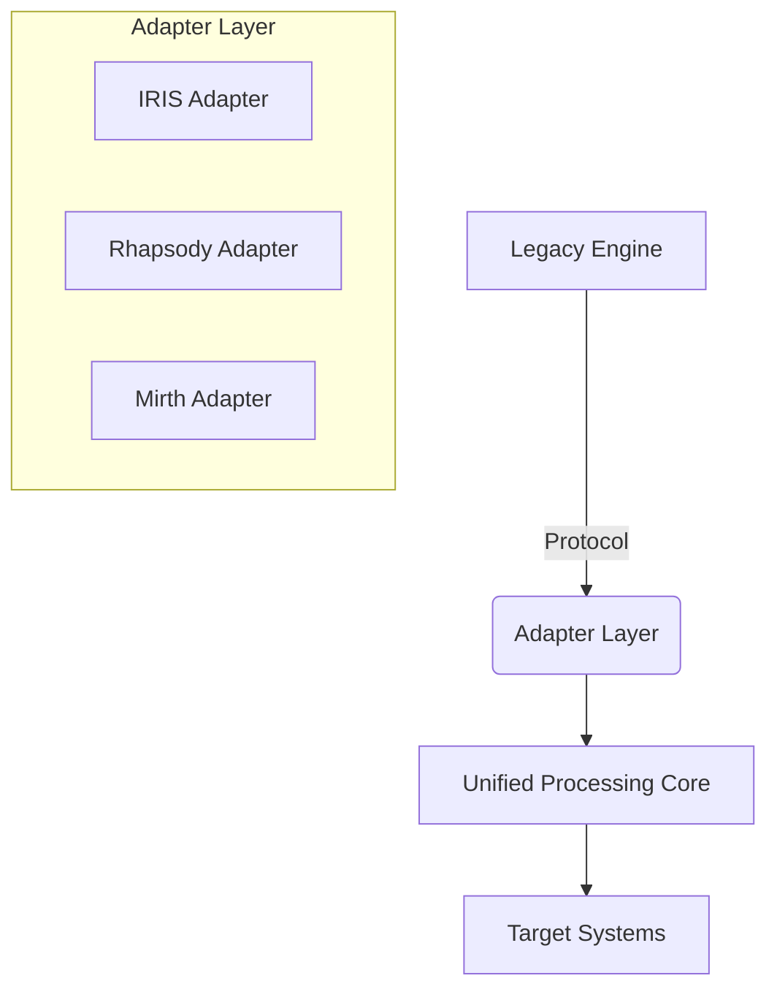

# Healthcare Integration Engines Analysis

## 1. InterSystems IRIS Integration Engine

### Key Features
- **Multi-Model Architecture**: Combines database, interoperability, and analytics in a single platform
- **HL7 Support**: Native support for HL7 v2.x, v3, and FHIR
- **Business Process Engine**: Visual process designer with BPMN support
- **Adaptability**: Built-in data transformation and routing rules
- **High Performance**: In-memory processing with persistent storage
- **Security**: HIPAA-compliant with granular access controls

### Migration Strategy
1. **Protocol Compatibility**
   - Implement IRIS-specific protocol adapters
   - Support Business Service/Operation model
   - Mirror production/operation concepts

2. **Data Transformation**
   - Support DTL (Data Transformation Language)
   - Implement compatible transformation functions
   - Support class-based transformations

3. **Management Interface**
   - Provide compatible REST APIs for management
   - Implement similar monitoring endpoints
   - Support IRIS-specific metrics and logging

---

## 2. Rhapsody Integration Engine

### Key Features
- **Message Flow Designer**: Visual interface for message processing
- **Connectivity**: 200+ pre-built connectors
- **Standards Support**: HL7, FHIR, DICOM, X12, NCPDP
- **Scalability**: Distributed deployment options
- **Testing Tools**: Built-in message testing and simulation

### Migration Strategy
1. **Message Flow Compatibility**
   - Support Rhapsody-compatible message flow definitions
   - Implement similar filter and routing logic
   - Support custom filters and routers

2. **Connector Framework**
   - Provide adapter SDK for custom connectors
   - Support common communication patterns
   - Implement channel-based messaging

3. **Testing & Monitoring**
   - Support Rhapsody test cases
   - Implement compatible monitoring interfaces
   - Provide migration tools for existing flows

---

## 3. Mirth Connect (NextGen Connect)

### Key Features
- **Channel-Based Architecture**: Source-Transformer-Destination model
- **JavaScript Transformations**: Custom message processing
- **Web Interface**: Browser-based administration
- **Extensibility**: Plugin architecture
- **Open Source**: Community and enterprise editions

### Migration Strategy
1. **Channel Migration**
   - Support Mirth channel definitions
   - Implement JavaScript transformation engine
   - Provide migration tools for existing channels

2. **Connectivity**
   - Support Mirth connector types
   - Implement compatible connection pooling
   - Provide similar error handling

3. **Management API**
   - Implement compatible REST API
   - Support Mirth's extension points
   - Provide monitoring compatibility

---

## Enhanced Architecture Design

### 1. Adapter Layer

### 2. Unified Processing Core
- **Message Processing Pipeline**:
  1. Protocol Decoding
  2. Normalization
  3. Transformation
  4. Routing
  5. Protocol Encoding

### 3. Migration Tools
- **Assessment Tool**: Analyze existing integration flows
- **Conversion Tools**: Convert engine-specific configurations
- **Validation Tools**: Verify migrated integrations
- **Coexistence Support**: Run parallel during migration

### 4. Compatibility Layer
- **API Gateway**: Unified REST/WebSocket interface
- **Protocol Bridges**: Legacy protocol support
- **Transformation Engine**: Support multiple transformation languages

## Implementation Roadmap

1. **Phase 1: Core Compatibility**
   - Implement base protocol adapters
   - Create transformation engine
   - Build basic routing framework

2. **Phase 2: Migration Tools**
   - Develop assessment tools
   - Build conversion utilities
   - Create validation framework

3. **Phase 3: Advanced Features**
   - Implement monitoring compatibility
   - Add management interfaces
   - Support high availability

## Technical Considerations

1. **Performance**
   - Asynchronous processing model
   - Connection pooling
   - Message batching

2. **Reliability**
   - Transaction support
   - Message persistence
   - Retry mechanisms

3. **Security**
   - TLS/SSL support
   - Authentication/Authorization
   - Audit logging

## Next Steps
1. Create detailed compatibility matrices
2. Develop prototype adapters
3. Build migration assessment tools
4. Implement core transformation engine
