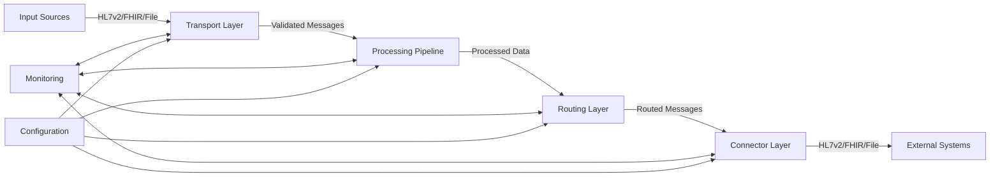

# Integration Engine Architecture

## Overview

The Integration Engine is a core component of the healthcare integration platform, designed to process and route healthcare messages between different systems and formats. It supports multiple protocols including HL7v2 (MLLP), FHIR (REST), and file-based inputs.

## Core Principles

1. **Event-Driven**: Asynchronous message processing
2. **Loose Coupling**: Services communicate via message queues
3. **Scalability**: Horizontally scalable components
4. **Resilience**: Built-in fault tolerance and recovery
5. **Extensibility**: Plugin-based architecture for adding new protocols and processors

## System Architecture

```mermaid
graph TD
    A[External Systems] -->|HL7/FHIR/CSV| B[Integration Engine]
    B -->|Processed Data| C[Destination Systems]
    
    subgraph Integration Engine
        D[Transport Layer] --> E[Processing Pipeline]
        E --> F[Routing Layer]
        F --> G[Connector Layer]
    end
    
    H[Monitoring & Logging] <--> Integration Engine
    I[Configuration] --> Integration Engine
```

## Core Components

### 1. Transport Layer
Handles protocol-specific communication:
- **HL7v2 Listener**: Receives HL7v2 messages via MLLP
- **FHIR Listener**: Provides RESTful API endpoints for FHIR resources
- **File Watcher**: Monitors directories for new files to process
- Supports multiple protocols (HTTP, MLLP, SFTP, etc.)
- Validates incoming messages

### 2. Processing Pipeline
- **Validation Service**: Validates incoming messages against schemas
- **Transformation Service**: Converts between different message formats
- **Message Processing**:
  - Message parsing and validation
  - Content transformation
  - Business rule execution

### 3. Routing Layer
- **Routing Service**: Routes messages based on configurable rules
  - Content-based routing
  - Message enrichment
  - Dynamic routing rules

### 4. Connector Layer
- **HL7v2 Sender**: Sends HL7v2 messages to external systems
- **FHIR Client**: Sends FHIR resources to FHIR servers
- **File Writer**: Writes processed messages to the file system
- Connection management
- Retry and error handling

### 5. Core Services
- **Queue Manager**: Manages message queues using Redis
- **Message Model**: Defines the structure of messages in the system
- **Configuration**: Centralized configuration management

## Data Flow



## Directory Structure

```
integration_engine/
├── config/               # Configuration files
├── core/                 # Core functionality
│   ├── interfaces/      # Abstract base classes
│   ├── models/          # Data models
│   ├── queues/          # Queue management
│   └── services/        # Core services
├── services/            # Service implementations
│   ├── input/          # Input services
│   ├── processing/     # Processing services
│   ├── routing/        # Routing services
│   └── output/         # Output services
├── tests/               # Test suites
└── utils/               # Utility functions
```

## Monitoring & Operations

- **Logging**: Structured logging for all operations
- **Metrics**: Performance and health metrics
- **Tracing**: Distributed request tracing
- **Alerting**: Configurable alerting rules

## Security Considerations

- Authentication for all external interfaces
- Message encryption in transit and at rest
- Audit logging for all operations
- Role-based access control

## Performance Characteristics

- Designed for high throughput
- Horizontal scaling support
- Configurable batching and parallel processing
- Resource usage monitoring and optimization

## Deployment Options

- Docker containers
- Kubernetes
- Cloud-native deployment
- On-premises deployment

## Extension Points

- Custom message processors
- Protocol adapters
- Transformation functions
- Routing rules
