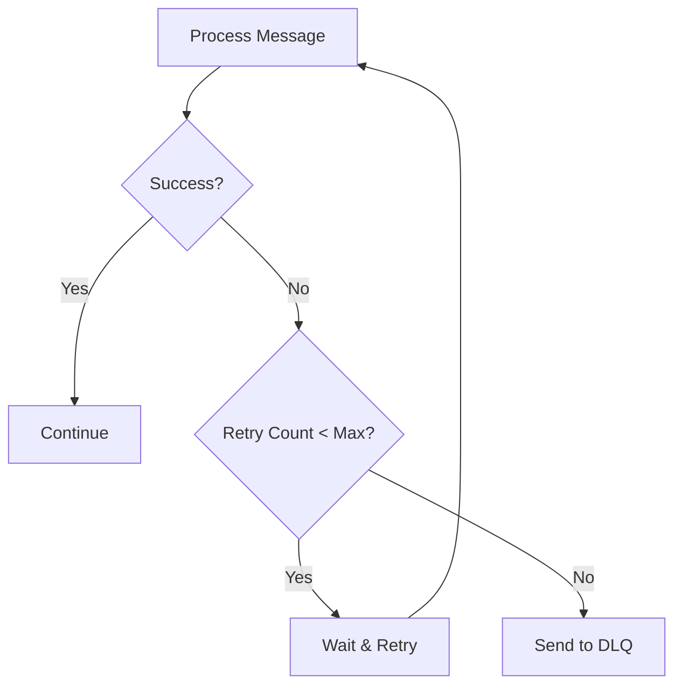

# Error Handling and Recovery

This document outlines the error handling and recovery mechanisms in the Integration Engine, ensuring robust operation and data integrity.

## Table of Contents
- [Error Classification](#error-classification)
- [Error Handling Strategies](#error-handling-strategies)
- [Recovery Mechanisms](#recovery-mechanisms)
- [Dead Letter Queue](#dead-letter-queue)
- [Monitoring and Alerting](#monitoring-and-alerting)
- [Best Practices](#best-practices)

## Error Classification

### 1. Transient Errors
Temporary issues that may resolve themselves with retries:
- Network timeouts
- Temporary service unavailability
- Resource constraints
- Rate limiting

### 2. Permanent Errors
Issues that won't resolve without intervention:
- Invalid message format
- Authentication failures
- Authorization errors
- Business rule violations

### 3. System Errors
Critical issues requiring immediate attention:
- Database connection failures
- File system errors
- Memory exhaustion
- Unhandled exceptions

## Error Handling Strategies

### 1. Retry Mechanism


### 2. Circuit Breaker Pattern
```yaml
# circuit-breaker-config.yaml
services:
  fhir-server:
    failure_threshold: 3
    success_threshold: 2
    timeout_ms: 5000
    reset_timeout_ms: 30000
```

### 3. Bulkhead Pattern
Isolate failures to prevent cascading issues:
- Separate thread pools for different operations
- Resource quotas per service
- Independent failure domains

## Recovery Mechanisms

### 1. Message Replay
```python
async def replay_message(message_id: str):
    """Replay a message from the dead letter queue."""
    message = await dead_letter_queue.get(message_id)
    await process_message(message)
    await dead_letter_queue.acknowledge(message_id)
```

### 2. Checkpointing
Track processing state for recovery:
```json
{
  "message_id": "msg_123",
  "status": "processing",
  "checkpoint": "transformation_complete",
  "retry_count": 2,
  "last_error": "Connection timeout",
  "timestamp": "2023-06-15T10:30:00Z"
}
```

### 3. Compensating Transactions
For distributed transactions:
```python
async def process_order(order):
    try:
        # Start transaction
        await inventory.reserve(order.items)
        await payment.process(order.payment)
        await shipping.schedule(order)
    except Exception as e:
        # Compensate for partial success
        await inventory.release(order.items)
        await payment.refund(order.payment)
        raise
```

## Dead Letter Queue (DLQ)

### Configuration
```yaml
# dlq-config.yaml
dead_letter_queue:
  enabled: true
  max_retries: 3
  retry_delay: 300  # seconds
  max_size: 10000
  retention_days: 30
```

### DLQ Message Format
```json
{
  "message_id": "msg_123",
  "original_queue": "incoming-orders",
  "error_type": "ValidationError",
  "error_message": "Missing required field: customer_id",
  "message_body": {
    "order_id": "ORD-456",
    "items": ["item1", "item2"]
  },
  "metadata": {
    "received_at": "2023-06-15T10:30:00Z",
    "failed_at": "2023-06-15T10:30:05Z",
    "retry_count": 3,
    "trace_id": "trace-123"
  }
}
```

## Monitoring and Alerting

### Metrics to Monitor
1. **Error Rates**
   - Error count by type
   - Error rate over time
   - Success/failure ratio

2. **Queue Metrics**
   - Queue length
   - Processing time
   - DLQ size

3. **System Health**
   - Resource usage
   - Service availability
   - Latency percentiles

### Alerting Rules
```yaml
alerts:
  - name: high-error-rate
    condition: rate(errors_total[5m]) > 10
    severity: critical
    annotations:
      summary: High error rate detected
      description: 'Error rate is {{ $value }} per second'

  - name: dlq-threshold
    condition: dlq_messages > 100
    severity: warning
    annotations:
      summary: Dead letter queue is growing
      description: 'DLQ has {{ $value }} messages'
```

## Best Practices

### 1. Error Logging
```python
logger.error(
    "Failed to process message",
    extra={
        "message_id": message.id,
        "error_type": type(e).__name__,
        "error": str(e),
        "trace_id": get_current_trace_id(),
        "component": "message_processor"
    },
    exc_info=True
)
```

### 2. Idempotency
```python
async def process_message(message):
    # Check if message was already processed
    if await is_duplicate(message.id):
        logger.info(f"Duplicate message {message.id}, skipping")
        return
    
    # Process message
    await do_work(message)
    
    # Record processing completion
    await mark_as_processed(message.id)
```

### 3. Timeouts
```python
import asyncio
from functools import partial

async def call_with_timeout(coro, timeout, default=None):
    try:
        return await asyncio.wait_for(coro, timeout=timeout)
    except asyncio.TimeoutError:
        logger.warning(f"Operation timed out after {timeout} seconds")
        return default
```

### 4. Backoff Strategies
```python
import random
from functools import wraps

def exponential_backoff(retries=3, base_delay=1, max_delay=30):
    def decorator(f):
        @wraps(f)
        async def wrapper(*args, **kwargs):
            delay = base_delay
            for attempt in range(retries):
                try:
                    return await f(*args, **kwargs)
                except TransientError as e:
                    if attempt == retries - 1:
                        raise
                    
                    # Add jitter
                    jitter = random.uniform(0, 0.1 * delay)
                    sleep_time = min(delay + jitter, max_delay)
                    
                    logger.warning(
                        f"Attempt {attempt + 1} failed, retrying in {sleep_time:.2f}s: {e}"
                    )
                    await asyncio.sleep(sleep_time)
                    delay *= 2  # Exponential backoff
        return wrapper
    return decorator
```

## Testing Error Handling

### Unit Tests
```python
import pytest
from unittest.mock import patch, MagicMock

@pytest.mark.asyncio
async def test_retry_mechanism():
    mock_service = MagicMock()
    mock_service.process.side_effect = [
        ConnectionError("Timeout"),
        ConnectionError("Timeout"),
        "Success"
    ]
    
    with patch('time.sleep'):
        result = await process_with_retry(mock_service, "test")
        
    assert result == "Success"
    assert mock_service.process.call_count == 3
```

### Integration Tests
```python
@pytest.mark.integration
async def test_circuit_breaker():
    # Test that circuit opens after failures
    with pytest.raises(CircuitBreakerOpen):
        for _ in range(5):
            try:
                await failing_service.call()
            except ServiceError:
                pass
    
    # Verify circuit is open
    with pytest.raises(CircuitBreakerOpen):
        await failing_service.call()
    
    # Verify circuit resets after timeout
    await asyncio.sleep(CIRCUIT_BREAKER_TIMEOUT + 1)
    with patch('failing_service.call', return_value="Success"):
        result = await failing_service.call()
        assert result == "Success"
```

## Incident Response

### 1. Detection
- Monitor error rates and system health
- Set up alerts for critical failures
- Implement distributed tracing

### 2. Triage
- Categorize the issue (transient/permanent)
- Assess impact and severity
- Notify appropriate teams

### 3. Mitigation
- Apply rate limiting
- Enable circuit breakers
- Reroute traffic if possible

### 4. Resolution
- Fix the root cause
- Verify the fix in staging
- Deploy to production

### 5. Post-Mortem
- Document the incident
- Identify preventive measures
- Update runbooks and monitoring

## Related Documents
- [Message Transformation](./message-transformation.md)
- [Monitoring and Alerting](./monitoring.md)
- [Deployment Guide](./deployment.md)
