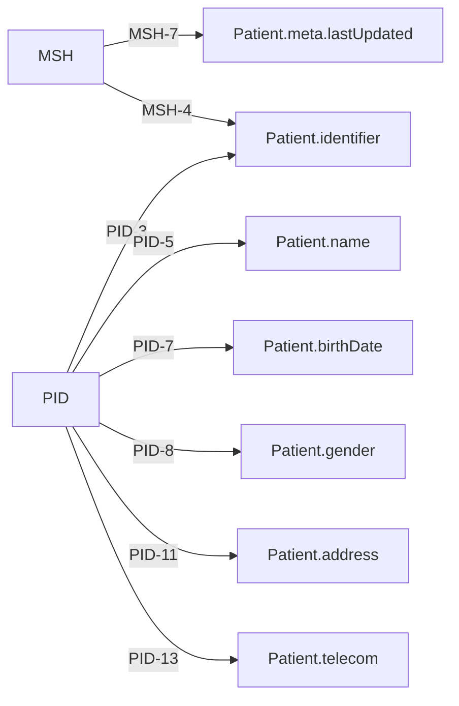
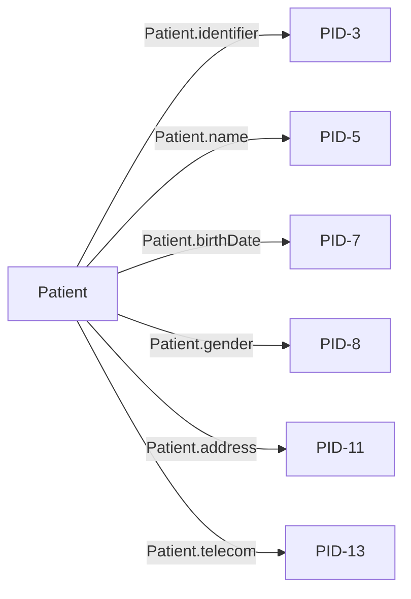

# Message Transformation Rules

This document outlines the message transformation rules and configurations used in the Integration Engine to convert between different healthcare data formats.

## Table of Contents
- [Supported Formats](#supported-formats)
- [Transformation Rules](#transformation-rules)
- [Custom Transformations](#custom-transformations)
- [Configuration](#configuration)
- [Validation](#validation)
- [Performance Considerations](#performance-considerations)

## Supported Formats

The Integration Engine supports the following healthcare data formats:

1. **HL7 v2.x**
   - ADT (Admission, Discharge, Transfer)
   - ORU (Observation Result)
   - SIU (Scheduling)
   - MDM (Medical Document Management)

2. **FHIR (R4)**
   - Resources: Patient, Observation, Encounter, etc.
   - Bundles for batch operations

3. **Custom Formats**
   - CSV/TSV
   - JSON
   - XML

## Transformation Rules

### HL7 v2 to FHIR

#### Patient (ADT^A01 → Patient)


#### Observation (ORU^R01 → Observation)
```mermaid
graph LR
    A[MSH] -->|MSH-7| B[Observation.effectiveDateTime]
    C[OBR] -->|OBR-4| D[Observation.code]
    C -->|OBR-7| B
    E[OBX] -->|OBX-3| D
    E -->|OBX-5| F[Observation.value[x]]
    E -->|OBX-6| G[Observation.valueQuantity.unit]
    E -->|OBX-8| H[Observation.interpretation]
```

### FHIR to HL7 v2

#### Patient (Patient → ADT^A08)


## Custom Transformations

### JavaScript Transformations
Custom JavaScript functions can be used for complex transformations:

```javascript
// Example: Custom name formatter
function formatPatientName(patient) {
    return {
        family: patient.name[0].family.toUpperCase(),
        given: patient.name[0].given.map(name => name.charAt(0).toUpperCase() + name.slice(1))
    };
}
```

### XSLT Transformations
For XML-based formats, XSLT transformations are supported:

```xml
<xsl:template match="patient">
    <Patient>
        <identifier>
            <value><xsl:value-of select="id"/></value>
        </identifier>
        <!-- Additional fields -->
    </Patient>
</xsl:template>
```

## Configuration

Transformation rules are configured in YAML files:

```yaml
# transformation-config.yaml
transformations:
  - name: hl7v2-to-fhir-patient
    source: hl7v2
    target: fhir
    type: patient
    mapping: mappings/hl7v2-to-fhir/patient.yaml
    
  - name: fhir-to-hl7v2-adt
    source: fhir
    target: hl7v2
    type: adt
    mapping: mappings/fhir-to-hl7v2/adt.yaml
```

## Validation

All transformations are validated against the following rules:

1. **Schema Validation**: Ensures output conforms to the target format schema
2. **Required Fields**: Validates all required fields are present
3. **Data Type Validation**: Ensures data types match the expected format
4. **Business Rules**: Applies domain-specific validation rules

## Performance Considerations

1. **Caching**: Transformation templates are cached for performance
2. **Batch Processing**: Supports batch processing for high volumes
3. **Streaming**: Large messages are processed using streaming when possible
4. **Parallel Processing**: Multiple transformations can run in parallel

## Error Handling

1. **Validation Errors**: Detailed error messages for schema violations
2. **Transformation Errors**: Logs and continues or fails based on configuration
3. **Retry Mechanism**: Automatic retry for transient failures

## Monitoring

1. **Metrics**: Transformation success/failure rates
2. **Performance**: Transformation duration and resource usage
3. **Audit Log**: Detailed logs of all transformations

## Extending Transformations

1. **Custom Functions**: Add custom JavaScript functions
2. **New Templates**: Create new transformation templates
3. **Plugins**: Develop plugins for complex transformations

## Best Practices

1. **Idempotency**: Ensure transformations are idempotent
2. **Validation**: Validate both input and output
3. **Logging**: Include detailed logging for debugging
4. **Testing**: Test with a variety of input data
5. **Documentation**: Document all custom transformations

## Examples

### HL7 v2 to FHIR Patient

**Input (HL7 v2)**:
```
MSH|^~\&|SENDING_APP|SENDING_FACILITY|RECEIVING_APP|RECEIVING_FACILITY|202306150800||ADT^A01|MSG00001|P|2.3|
EVN|A01|202306150800|||
PID|1||12345||DOE^JOHN^A^JR|19800101|M||2106-3|123 MAIN ST^^BOSTON^MA^02118||(555)555-1234|(555)555-5678||S||123-45-6789|
```

**Output (FHIR)**:
```json
{
  "resourceType": "Patient",
  "id": "12345",
  "identifier": [{
    "system": "urn:oid:2.16.840.1.113883.4.1",
    "value": "123-45-6789"
  }],
  "name": [{
    "family": "Doe",
    "given": ["John", "A"],
    "suffix": ["Jr"]
  }],
  "gender": "male",
  "birthDate": "1980-01-01",
  "address": [{
    "line": ["123 MAIN ST"],
    "city": "BOSTON",
    "state": "MA",
    "postalCode": "02118"
  }],
  "telecom": [
    {
      "system": "phone",
      "value": "555-555-1234",
      "use": "home"
    },
    {
      "system": "phone",
      "value": "555-555-5678",
      "use": "work"
    }
  ]
}
```

## Troubleshooting

### Common Issues

1. **Missing Fields**: Ensure all required fields are mapped
2. **Data Type Mismatches**: Verify data types match the target format
3. **Performance Bottlenecks**: Check for complex transformations that could be optimized
4. **Memory Issues**: For large messages, use streaming transformations

### Debugging

1. **Enable Debug Logging**: Set log level to DEBUG for detailed transformation logs
2. **Test with Sample Data**: Use small, representative samples for testing
3. **Incremental Testing**: Test transformations incrementally
4. **Validation Reports**: Review validation reports for detailed error information

## Versioning

Transformation rules are versioned to support backward compatibility:

```yaml
version: 1.0.0
compatibility:
  min_engine_version: "1.0.0"
  deprecated: false
```

## Security Considerations

1. **Input Validation**: Validate all input to prevent injection attacks
2. **Sensitive Data**: Handle sensitive data according to security policies
3. **Access Control**: Restrict access to transformation configurations
4. **Audit Logging**: Log all transformation activities

## Related Documents

- [FHIR Implementation Guide](http://hl7.org/fhir/)
- [HL7 v2.5.1 Standard](https://www.hl7.org/implement/standards/product_brief.cfm?product_id=144)
- [Integration Engine Architecture](architecture.md)
