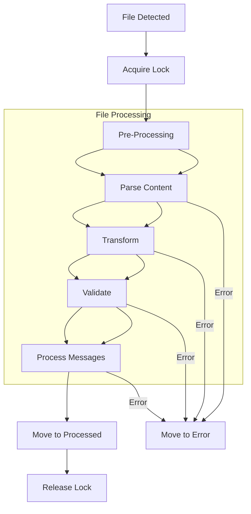
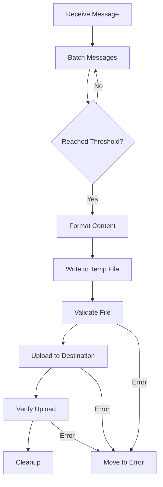

# File and CSV Protocol Support

## 1. Supported Protocols

### 1.1 File Protocols
- **Local File System**
- **SFTP** (Secure File Transfer Protocol)
- **SMB/CIFS** (Windows Shares)
- **NFS** (Network File System)
- **S3** (AWS S3 and S3-compatible)
- **Azure Blob Storage**
- **Google Cloud Storage**

### 1.2 File Formats
- **CSV** (Comma/Tab/Delimiter-Separated Values)
- **Fixed Width**
- **JSON Lines**
- **XML**
- **HL7** (as flat files)
- **FHIR** (NDJSON)

## 2. Inbound File Processing

### 2.1 Configuration

```yaml
inbound_services:
  file_ingestion:
    type: file_inbound
    transport:
      protocol: sftp
      host: sftp.hospital.org
      port: 22
      credentials:
        username: ${SFTP_USER}
        password: ${SFTP_PASSWORD}
      paths:
        - /incoming/lab_results/*.csv
        - /incoming/patient_data/*.hl7
    options:
      move_processed: /processed/%Y-%m-%d/
      error_path: /errors/
      archive: true
      archive_path: /archive/%Y/%m/%d/
      delete_after_processing: false
      chunk_size: 10MB
      encoding: utf-8
      line_terminator: "\n"
```

### 2.2 CSV Processing Options

```yaml
    format:
      type: csv
      options:
        delimiter: ","
        has_header: true
        skip_lines: 0
        quote_char: '"'
        escape_char: "\\"
        null_value: ""
        date_format: "%Y-%m-%d"
        datetime_format: "%Y-%m-%d %H:%M:%S"
        columns:
          - name: patient_id
            type: string
            required: true
          - name: test_date
            type: datetime
            format: "%Y%m%d%H%M%S"
          - name: result_value
            type: decimal
            precision: 2
```

### 2.3 File Polling Strategies

```yaml
    polling:
      interval: 60s
      strategy: modified_time  # or: size, checksum, pattern
      recursive: true
      max_depth: 5
      file_age_min: 5m  # ignore files younger than
      file_age_max: 7d   # ignore files older than
      file_pattern: "*.{csv,txt}"
      sort_by: modified_time  # or: name, size
      sort_order: desc
```

## 3. Outbound File Generation

### 3.1 Configuration

```yaml
outbound_services:
  file_export:
    type: file_outbound
    transport:
      protocol: s3
      bucket: hospital-exports
      region: us-east-1
      credentials:
        access_key_id: ${AWS_ACCESS_KEY}
        secret_access_key: ${AWS_SECRET_KEY}
      path: "exports/%{app}/%Y/%m/%d/"
      filename: "export_%Y%m%d_%H%M%S.csv"
    options:
      temp_dir: /tmp/exports
      overwrite: never  # or: always, rename
      permissions: 0644
      buffer_size: 5MB
      max_file_size: 1GB
      rotate_interval: 1h
      gzip: true
      gzip_level: 6
```

### 3.2 CSV Generation Options

```yaml
    format:
      type: csv
      options:
        delimiter: "\t"
        include_header: true
        line_terminator: "\r\n"
        quote_all: false
        quote: '"'
        escape: '"'
        null_value: ""
        date_format: "%Y-%m-%d"
        datetime_format: "%Y-%m-%dT%H:%M:%SZ"
        encoding: utf-8
        bom: true
```

## 4. File Processing Pipeline

### 4.1 Inbound Flow



### 4.2 Outbound Flow



## 5. Advanced Features

### 5.1 File Operations
- **Atomic Writes**: Write to temp file then rename
- **Transaction Support**: Rollback on failure
- **Chunked Processing**: Process large files in chunks
- **Compression**: GZIP, ZIP, BZIP2 support
- **Encryption**: PGP, AES-256

### 5.2 CSV-Specific Features
- **Schema Evolution**: Handle schema changes
- **Type Inference**: Auto-detect column types
- **Data Validation**: Regex, ranges, enums
- **Transformation**: Field mapping, value conversion
- **Streaming**: Process large files with minimal memory

### 5.3 Monitoring
- File processing metrics
- Data quality reports
- Audit trails
- Alerting on failures

## 6. Security Considerations

### 6.1 Authentication
- SSH Keys (SFTP)
- Access Keys (S3)
- Service Principals (Azure)
- OAuth2 (Google Cloud)

### 6.2 Encryption
- TLS for network transfer
- Encryption at rest
- Client-side encryption
- Key management

## 7. Error Handling

### 7.1 Recovery
- Retry with backoff
- Dead letter queues
- Manual intervention paths
- Partial processing support

### 7.2 Notifications
- Email alerts
- Webhooks
- Log aggregation
- Metrics monitoring

## 8. Performance Optimization

### 8.1 Tuning Parameters
- Batch sizes
- Parallel processing
- Memory buffers
- Compression levels

### 8.2 Scaling
- Horizontal scaling
- Distributed processing
- Load balancing

## 9. Example Configurations

### 9.1 SFTP Ingest with CSV Processing

```yaml
inbound_services:
  sftp_lab_results:
    type: file_inbound
    transport:
      protocol: sftp
      host: lab-sftp.hospital.org
      port: 22
      credentials:
        username: ${SFTP_USER}
        private_key: ${SFTP_PRIVATE_KEY}
      paths:
        - /incoming/lab_results/*.csv
    options:
      move_processed: /processed/%Y-%m-%d/
      error_path: /errors/
    format:
      type: csv
      options:
        has_header: true
        delimiter: ","
        columns:
          - name: patient_id
            type: string
          - name: test_code
            type: string
          - name: result_value
            type: float
          - name: test_date
            type: datetime
            format: "%Y%m%d%H%M%S"
```

### 9.2 S3 Export with JSON Lines

```yaml
outbound_services:
  s3_patient_export:
    type: file_outbound
    transport:
      protocol: s3
      bucket: patient-exports
      path: "exports/patient_data/%Y/%m/%d/"
      filename: "patients_%Y%m%d_%H%M%S.jsonl"
    options:
      rotate_interval: 1h
      gzip: true
    format:
      type: jsonl
      options:
        pretty: false
        timestamp_format: "%Y-%m-%dT%H:%M:%SZ"
```
