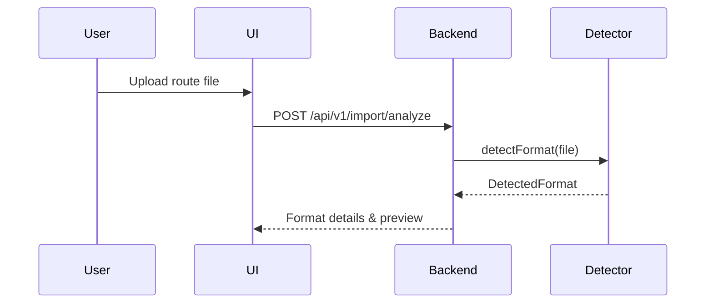
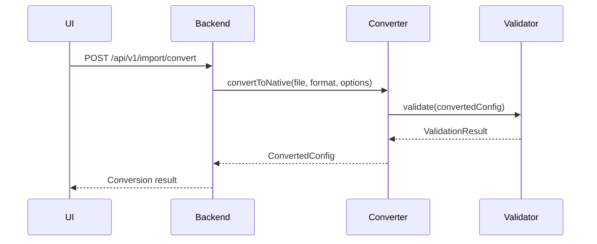

# Route Import System Design

## Overview
This document outlines the design for importing and converting route configurations from various healthcare integration engines into our unified configuration format.

## Supported Formats

### 1. InterSystems Production (XML)
**File Pattern**: `*.pkg`, `*.cls`, `*.xml`  
**Key Elements**:
```xml
<Production Name="MyProduction">
  <Item Name="HL7Service" ClassName="EnsLib.HL7.Service.FileService">
    <Setting Target="Host" Name="TargetConfigNames">HL7Process</Setting>
  </Item>
  <Item Name="HL7Process" ClassName="MyApp.HL7.Process">
    <Setting Target="Host" Name="Target">HL7Operation</Setting>
  </Item>
</Production>
```

### 2. Mirth Connect (XML)
**File Pattern**: `*.xml` (Channel exports)  
**Key Elements**:
```xml
<channel version="3.12.0">
  <id>d3e2f1a0-1234-5678-90ab-cdef12345678</id>
  <name>HL7 ADT Inbound</name>
  <sourceConnector version="3.12.0">
    <properties class="llcon">
      <protocol>TCP</protocol>
      <host>0.0.0.0</host>
      <port>6661</port>
    </properties>
  </sourceConnector>
  <destinationConnectors>
    <connector version="3.12.0">
      <name>HL7 Outbound</name>
      <properties class="llcon">
        <host>emr-server</host>
        <port>4100</port>
      </properties>
    </connector>
  </destinationConnectors>
</channel>
```

### 3. Rhapsody (XML/JSON)
**File Pattern**: `*.rhapsody`, `*.json`  
**Key Elements**:
```json
{
  "name": "HL7 ADT Processing",
  "components": [
    {
      "type": "llp:receiver",
      "name": "HL7 Inbound",
      "properties": {
        "port": 2575,
        "ackTimeout": "30s"
      }
    },
    {
      "type": "router",
      "name": "Message Router",
      "routes": [
        {
          "condition": "messageType == 'ADT_A01'",
          "target": "ADT Processor"
        }
      ]
    }
  ]
}
```

## Import Process

### 1. Detection Phase


### 2. Conversion Phase


## Configuration Structure

### Native Format (YAML)
```yaml
version: '1.0'
services:
  - name: hl7-inbound
    type: inbound
    transport:
      protocol: mllp
      port: 2575
    protocol:
      type: hl7v2
    routes:
      - name: process-adt
        condition: message.type == 'ADT'
        actions:
          - transform: hl7-to-internal
          - route: adt-processor
```

### Import Mapping (Example: InterSystems → Native)
```yaml
mappings:
  - from: InterSystems
    patterns:
      - "*.pkg"
      - "Production.xml"
    rules:
      - match: "//Item[@ClassName='EnsLib.HL7.Service.FileService']"
        target: "services[?name=='hl7-inbound']"
        properties:
          type: inbound
          transport.protocol: file
          transport.path: "{{xpath('//Setting[@Name=\'FilePath\']/text()')}}"
```

## API Endpoints

### 1. Analyze Import File
```http
POST /api/v1/import/analyze
Content-Type: multipart/form-data

{
  "file": "<file_data>",
  "hint": "interSystems"  # Optional
}
```

### 2. Convert Configuration
```http
POST /api/v1/import/convert
Content-Type: application/json

{
  "file_id": "<file_id>",
  "format": "interSystems",
  "options": {
    "preserve_ids": true,
    "include_comments": true
  }
}
```

## Implementation Plan

1. **Core Modules**
   - `importers/` - Format-specific importers
   - `converters/` - Conversion logic
   - `validators/` - Configuration validation
   - `mappers/` - Field mapping rules

2. **Dependencies**
   - `lxml` - XML processing
   - `pyyaml` - YAML handling
   - `jsonschema` - Validation
   - `pydantic` - Data modeling

3. **Testing Strategy**
   - Unit tests for each importer
   - Golden master testing with sample files
   - Round-trip conversion validation

## Migration Path

1. **Phase 1: Read-Only Import**
   - Import and view configurations
   - Manual adjustment in UI
   - Export to native format

2. **Phase 2: Bidirectional Sync**
   - Track changes
   - Support updates to imported configs
   - Conflict resolution

3. **Phase 3: Live Monitoring**
   - Monitor source configurations
   - Detect and notify about changes
   - Automated sync options
