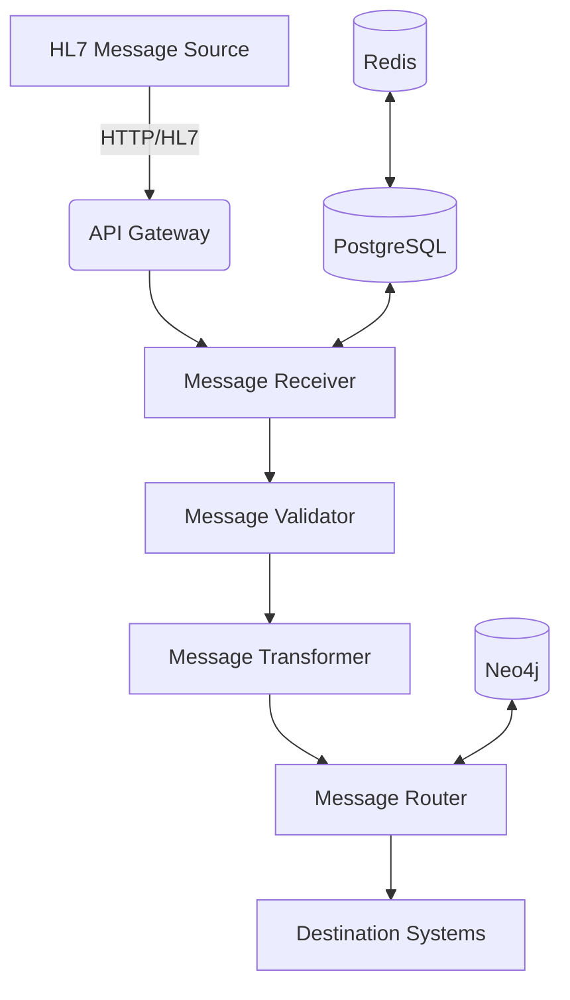

# HL7 Message Processing System

## Architecture Overview

The HL7 Message Processing System is designed to handle healthcare integration scenarios with the following components:



## Core Components

### 1. Message Processing Pipeline

#### HL7Message
- Parses and validates HL7 v2.x messages
- Extracts key fields (MSH, PID, PV1, etc.)
- Handles message acknowledgment (ACK)

#### HL7MessageProcessor
- Orchestrates the processing pipeline
- Handles validation and transformation
- Manages error handling and retries

### 2. Storage Layer

#### PostgreSQL
- Stores complete message payloads
- Maintains message status and metadata
- Enables historical queries and auditing

#### Redis
- Caches frequently accessed messages
- Improves read performance
- Reduces database load

### 3. Routing Engine (Neo4j)

#### Graph Schema
```
(System)-[:RECEIVES]->(MessageType)
(MessageType)-[:HAS_ROUTE]->(RoutingRule)
(RoutingRule)-[:ROUTES_TO]->(Destination)
```

#### Sample Queries
```cypher
// Find all systems that can handle ADT_A01 messages
MATCH (s:System)-[:RECEIVES]->(m:MessageType {id: 'ADT_A01'})
RETURN s.id, s.name, s.type

// Get routing rules for a message type
MATCH (m:MessageType {id: $message_type})-[:HAS_ROUTE]->(r:RoutingRule)
RETURN r.id, r.condition, r.priority
```

## API Endpoints

### POST /api/v1/hl7/process
Process an HL7 message

**Request:**
```json
{
  "content": "MSH|^~\&|SENDING_APP|...",
  "source_system": "registration",
  "metadata": {
    "priority": "high"
  }
}
```

**Response:**
```json
{
  "message_id": "MSG12345",
  "status": "processed",
  "destinations": ["ehr_system"],
  "processing_time_ms": 42
}
```

### GET /api/v1/hl7/{message_id}
Retrieve a processed message

### GET /api/v1/hl7/
List messages with filtering

## Message Flow

1. **Ingestion**
   - Message received via API or file upload
   - Assigned unique ID and timestamp
   - Stored in PostgreSQL

2. **Validation**
   - Syntax validation (HL7 v2.x)
   - Required fields check
   - Schema validation

3. **Transformation**
   - Field mapping
   - Data enrichment
   - Format conversion

4. **Routing**
   - Determine destinations using Neo4j
   - Apply routing rules
   - Handle acknowledgments

5. **Delivery**
   - Send to target systems
   - Handle retries
   - Update status

## Error Handling

### Retry Logic
- Exponential backoff
- Configurable max attempts
- Dead letter queue for failed messages

### Monitoring
- Prometheus metrics
- Error logging
- Alerting

## Setup Instructions

### Prerequisites
- Docker and Docker Compose
- Python 3.9+

### Configuration
1. Copy `.env.example` to `.env`
2. Update environment variables

### Running the System
```bash
# Start services
docker-compose up -d postgres redis neo4j

# Run migrations
alembic upgrade head

# Start the API
uvicorn app.main:app --reload
```

### Running the Demo
```bash
python -m scripts.demo_hl7_flow
```

## Performance Considerations

### Scaling
- Horizontal scaling of API workers
- Connection pooling for databases
- Async I/O operations

### Caching Strategy
- Redis for message caching
- Query result caching
- Cache invalidation policies

## Security

### Authentication
- JWT-based authentication
- API key support
- Role-based access control

### Data Protection
- Encryption at rest
- TLS for data in transit
- Audit logging

## Monitoring and Logging

### Metrics
- Request rates
- Processing times
- Error rates

### Logging
- Structured JSON logging
- Correlation IDs
- Log aggregation

## Future Enhancements

### Planned Features
- Support for HL7 FHIR
- GraphQL API
- Webhook notifications
- Plug-in architecture for custom processors

### Research Areas
- Machine learning for routing optimization
- Anomaly detection
- Predictive scaling
