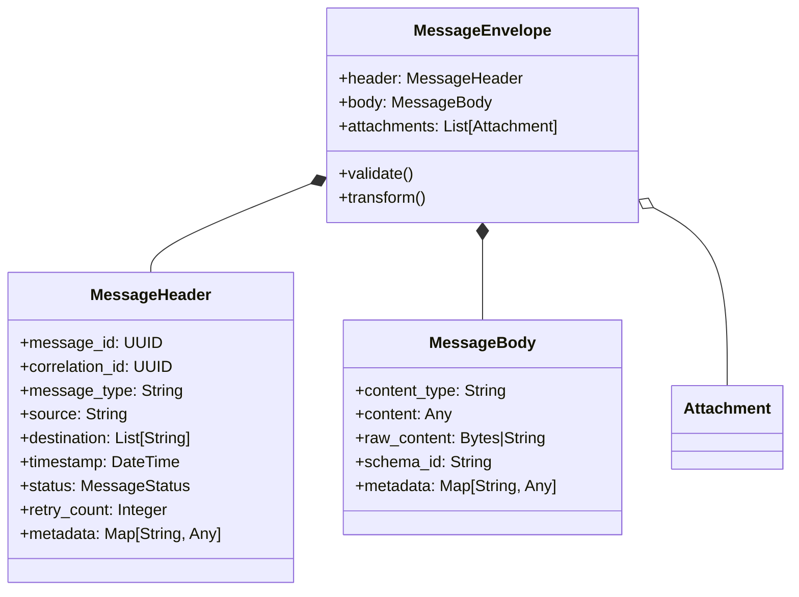

# Component Specifications

## Core Components

### 1. Message Envelope



### 2. Transport Layer

#### Listeners
- **HTTP Listener**
  - REST API endpoints
  - Webhook support
  - Request/response handling

- **MLLP Listener**
  - Min/Max LLP header configuration
  - Keep-alive connections
  - Backpressure handling

- **File Poller**
  - Directory monitoring
  - File patterns
  - In-progress handling

### 3. Processing Layer

#### Validators
- Schema validation
- Business rule validation
- Content validation

#### Transformers
- Template-based
- Scriptable
- XSLT support

### 4. Routing Layer

#### Routers
- Content-Based Router
- Recipient List
- Dynamic Router
- Message Filter

### 5. Connector Layer

#### Senders
- **MLLP Sender**
  - Connection pooling
  - ACK/NAK handling
  - Keep-alive

- **FHIR Client**
  - Resource operations
  - Batch/transaction support
  - Conditional operations

## Plugin System

### Plugin Types
1. **Validators**
   - Schema validation
   - Business rule validation
   - Content validation

2. **Transformers**
   - Message transformation
   - Data mapping
   - Content enrichment

3. **Routers**
   - Custom routing logic
   - Dynamic routing rules
   - Recipient resolution

### Plugin Interface

```python
class IntegrationPlugin(ABC):
    @abstractmethod
    def initialize(self, config: dict) -> None:
        """Initialize the plugin with configuration."""
        pass
    
    @abstractmethod
    def process(self, message: MessageEnvelope) -> MessageEnvelope:
        """Process the message."""
        pass
    
    @abstractmethod
    def shutdown(self) -> None:
        """Clean up resources."""
        pass
```

## Message Flow

### Processing Pipeline
1. **Receive** - Message is received by a listener
2. **Parse** - Message is parsed into internal format
3. **Validate** - Message is validated against schema
4. **Transform** - Message is transformed as needed
5. **Route** - Destination is determined
6. **Send** - Message is sent to destination
7. **Acknowledge** - Sender is acknowledged

### Error Handling
- **Transient Errors**: Automatic retry with backoff
- **Permanent Errors**: Dead letter queue
- **Poison Messages**: Quarantine with notification

## Configuration

### Message Routing
```yaml
routes:
  - name: hl7_to_fhir
    description: Convert HL7 to FHIR
    source:
      protocol: mllp
      port: 2575
    destination:
      protocol: http
      url: http://fhir-server/fhir
    transformations:
      - type: hl7_to_fhir
        template: templates/hl7_to_fhir.json
    validation:
      schema: schemas/hl7_v2.json
```

### Plugin Configuration
```yaml
plugins:
  - name: hl7_validator
    type: validator
    class: integration_engine.plugins.validators.hl7.Validator
    config:
      schema_dir: /etc/integration/schemas/hl7
  - name: fhir_transformer
    type: transformer
    class: integration_engine.plugins.transformers.fhir.Transformer
    config:
      fhir_version: R4
```

## Performance Considerations

### Throughput Optimization
- Batch processing
- Parallel processing
- Connection pooling
- Message batching

### Resource Management
- Memory usage
- Connection pooling
- Thread management
- Garbage collection

## Security Considerations

### Data Protection
- Encryption at rest
- Encryption in transit
- Data masking

### Access Control
- Authentication
- Authorization
- Audit logging
