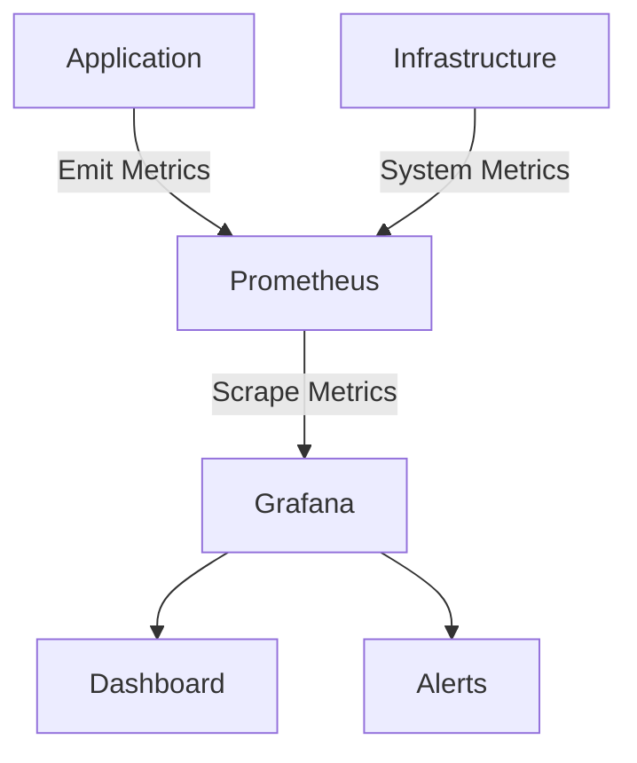

# Performance Tuning Guide

This guide provides comprehensive recommendations and best practices for optimizing the performance of the Integration Engine in various deployment scenarios.

## Table of Contents
- [Performance Metrics](#performance-metrics)
- [Configuration Tuning](#configuration-tuning)
- [Database Optimization](#database-optimization)
- [Caching Strategies](#caching-strategies)
- [Message Processing](#message-processing)
- [Scaling Strategies](#scaling-strategies)
- [Monitoring and Analysis](#monitoring-and-analysis)
- [Benchmarking](#benchmarking)
- [Troubleshooting](#troubleshooting)

## Performance Metrics

### Key Performance Indicators (KPIs)

| Metric | Target | Description |
|--------|--------|-------------|
| Throughput | 1,000+ msg/s | Messages processed per second |
| Latency (p95) | < 100ms | Time to process a message |
| Error Rate | < 0.1% | Percentage of failed messages |
| Resource Usage | CPU < 70% | System resource utilization |
| Queue Depth | < 100 | Pending messages in queue |

### Monitoring Dashboard



## Configuration Tuning

### Application Configuration

```yaml
# config/production.yaml
server:
  workers: 4  # Match CPU cores
  max_requests: 1000  # Restart workers after N requests
  timeout: 30  # Request timeout in seconds

redis:
  pool_size: 20  # Connection pool size
  max_connections: 50  # Max Redis connections
  socket_timeout: 5  # Socket timeout in seconds

database:
  pool_size: 10  # Database connection pool
  max_overflow: 20  # Max overflow connections
  pool_timeout: 30  # Connection timeout in seconds
  pool_recycle: 3600  # Recycle connections after 1 hour
```

### JVM Tuning (if applicable)

```bash
JAVA_OPTS="-Xms2g -Xmx4g -XX:+UseG1GC -XX:MaxGCPauseMillis=200 -XX:ParallelGCThreads=4 -XX:ConcGCThreads=2"
```

## Database Optimization

### Indexing Strategy

```sql
-- Commonly queried fields
CREATE INDEX idx_messages_status ON messages(status);
CREATE INDEX idx_messages_created_at ON messages(created_at);
CREATE INDEX idx_messages_correlation_id ON messages(correlation_id);

-- Composite index for common query patterns
CREATE INDEX idx_messages_status_created ON messages(status, created_at);
```

### Query Optimization

1. **Use EXPLAIN ANALYZE**
   ```sql
   EXPLAIN ANALYZE SELECT * FROM messages WHERE status = 'processed';
   ```

2. **Avoid SELECT ***
   ```sql
   -- Instead of
   SELECT * FROM messages;
   
   -- Use
   SELECT id, status, created_at FROM messages;
   ```

3. **Batch Operations**
   ```python
   # Instead of individual inserts
   async with database.transaction():
       for message in messages:
           await database.execute(insert(messages).values(message))
   ```

## Caching Strategies

### Multi-level Caching

```python
class MessageCache:
    def __init__(self, redis, local_cache_ttl=300):
        self.redis = redis
        self.local_cache = {}
        self.local_cache_ttl = local_cache_ttl
    
    async def get(self, key):
        # Check local cache first
        if cached := self.local_cache.get(key):
            if time.time() - cached['timestamp'] < self.local_cache_ttl:
                return cached['value']
        
        # Then check Redis
        if value := await self.redis.get(key):
            # Update local cache
            self.local_cache[key] = {
                'value': value,
                'timestamp': time.time()
            }
            return value
        
        return None
```

### Cache Invalidation

```python
@asynccontextmanager
async def cache_invalidator(keys: List[str]):
    try:
        yield
    finally:
        # Invalidate cache after operation
        await asyncio.gather(
            *[redis.delete(key) for key in keys]
        )
```

## Message Processing

### Batch Processing

```python
async def process_batch(messages: List[Message], batch_size: int = 100):
    for i in range(0, len(messages), batch_size):
        batch = messages[i:i + batch_size]
        await asyncio.gather(*[
            process_message(msg) for msg in batch
        ])
```

### Backpressure Handling

```python
from asyncio import Semaphore

class RateLimiter:
    def __init__(self, rate_limit):
        self.semaphore = Semaphore(rate_limit)
    
    async def acquire(self):
        await self.semaphore.acquire()
    
    def release(self):
        self.semaphore.release()

# Usage
rate_limiter = RateLimiter(100)  # 100 concurrent operations

async def process_with_backpressure(message):
    await rate_limiter.acquire()
    try:
        return await process_message(message)
    finally:
        rate_limiter.release()
```

## Scaling Strategies

### Horizontal Scaling

```yaml
# values-production.yaml
replicaCount: 5

autoscaling:
  enabled: true
  minReplicas: 3
  maxReplicas: 20
  targetCPUUtilizationPercentage: 70
  targetMemoryUtilizationPercentage: 80
```

### Queue-based Load Leveling

```python
async def process_queue(queue_name, worker_count=10):
    semaphore = asyncio.Semaphore(worker_count)
    
    async def worker():
        while True:
            message = await queue.get()
            try:
                await process_message(message)
            except Exception as e:
                logger.error(f"Error processing message: {e}")
            finally:
                queue.task_done()
    
    # Start workers
    workers = [
        asyncio.create_task(worker())
        for _ in range(worker_count)
    ]
    
    # Wait for all messages to be processed
    await queue.join()
    
    # Cancel workers
    for worker in workers:
        worker.cancel()
    await asyncio.gather(*workers, return_exceptions=True)
```

## Monitoring and Analysis

### Performance Metrics

```python
from prometheus_client import Counter, Histogram, start_http_server

# Define metrics
MESSAGES_PROCESSED = Counter(
    'messages_processed_total',
    'Total number of messages processed',
    ['status']
)

PROCESSING_TIME = Histogram(
    'message_processing_seconds',
    'Time spent processing messages',
    ['message_type']
)

# Usage
@PROCESSING_TIME.time()
async def process_message(message):
    # Process message
    MESSAGES_PROCESSED.labels(status='success').inc()
```

### Log Analysis

```bash
# Top slowest endpoints
cat access.log | awk '{print $7, $NF}' | sort -k2 -nr | head -n 20

# Error rate by endpoint
cat access.log | grep ' 5\\d\\d ' | awk '{print $7}' | sort | uniq -c | sort -nr

# Memory usage over time
kubectl top pods -n integration --containers | grep integration-engine
```

## Benchmarking

### Load Testing with Locust

```python
from locust import HttpUser, task, between

class IntegrationEngineUser(HttpUser):
    wait_time = between(0.5, 2.5)
    
    @task
    def process_message(self):
        self.client.post("/api/messages", json={
            "type": "hl7",
            "data": "MSH|^~\\&|SENDING_APP|SENDING_FACILITY|..."
        })
```

Run with:
```bash
locust -f locustfile.py --host=http://localhost:8000
```

### Benchmarking Script

```python
import asyncio
import time
import statistics
from typing import List, Dict, Any

async def benchmark(
    func: callable,
    args: List[Any] = None,
    kwargs: Dict[str, Any] = None,
    iterations: int = 1000,
    concurrency: int = 10
) -> Dict[str, float]:
    """Run benchmark tests on a function."""
    args = args or []
    kwargs = kwargs or {}
    
    async def run_one() -> float:
        start = time.monotonic()
        await func(*args, **kwargs)
        return (time.monotonic() - start) * 1000  # Convert to ms
    
    # Warm-up
    await asyncio.gather(*[run_one() for _ in range(10)])
    
    # Run benchmark
    tasks = [run_one() for _ in range(iterations)]
    results = []
    
    for i in range(0, len(tasks), concurrency):
        batch = tasks[i:i + concurrency]
        results.extend(await asyncio.gather(*batch))
    
    # Calculate statistics
    return {
        'iterations': iterations,
        'concurrency': concurrency,
        'total_time': sum(results),
        'avg': statistics.mean(results),
        'min': min(results),
        'max': max(results),
        'p50': statistics.quantiles(results, n=100)[49],
        'p95': statistics.quantiles(results, n=100)[94],
        'p99': statistics.quantiles(results, n=100)[98],
    }
```

## Troubleshooting

### Performance Issues

1. **High CPU Usage**
   ```bash
   # Get top CPU-consuming threads
   top -H -p $(pgrep -f integration-engine)
   
   # Get thread dump
   jstack $(pgrep -f integration-engine) > thread_dump.txt
   ```

2. **Memory Leaks**
   ```bash
   # Get heap dump
   jmap -dump:format=b,file=heap.hprof $(pgrep -f integration-engine)
   
   # Analyze with Eclipse MAT or YourKit
   ```

3. **Slow Queries**
   ```sql
   -- Enable slow query log
   SET GLOBAL slow_query_log = 'ON';
   SET GLOBAL long_query_time = 1;
   SET GLOBAL slow_query_log_file = '/var/log/mysql/mysql-slow.log';
   ```

### Profiling

#### Python Profiling with cProfile

```python
import cProfile
import pstats
import io
from pstats import SortKey

pr = cProfile.Profile()
pr.enable()

# Your code here

pr.disable()
s = io.StringIO()
sortby = SortKey.CUMULATIVE
ps = pstats.Stats(pr, stream=s).sort_stats(sortby)
ps.print_stats()
print(s.getvalue())
```

#### Line Profiler

```python
@profile
def slow_function():
    # Code to profile
    pass
```

## Best Practices

1. **Connection Pooling**
   - Reuse database connections
   - Set appropriate pool sizes
   - Monitor connection usage

2. **Asynchronous I/O**
   - Use async/await for I/O-bound operations
   - Avoid blocking calls in event loop
   - Use thread pool for CPU-bound tasks

3. **Caching**
   - Cache frequently accessed data
   - Implement cache invalidation
   - Use appropriate TTLs

4. **Monitoring**
   - Track key metrics
   - Set up alerts
   - Regular performance reviews

5. **Testing**
   - Load test before deployment
   - Profile critical paths
   - Monitor in production

## Related Documents
- [Deployment Guide](../deployment/integration-engine/README.md)
- [Error Handling](../architecture/integration-engine/error-handling.md)
- [Monitoring Guide](../monitoring/README.md)
