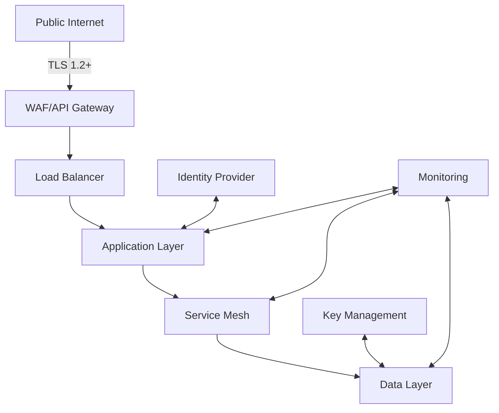

# Security Best Practices for Integration Engine

This document outlines the security measures, best practices, and compliance requirements for securing the Integration Engine in healthcare environments.

## Table of Contents
- [Security Architecture](#security-architecture)
- [Authentication & Authorization](#authentication--authorization)
- [Data Protection](#data-protection)
- [Network Security](#network-security)
- [Audit Logging](#audit-logging)
- [Compliance](#compliance)
- [Incident Response](#incident-response)
- [Secure Development](#secure-development)
- [Third-Party Security](#third-party-security)
- [Security Testing](#security-testing)

## Security Architecture

### Defense in Depth



### Components

1. **Perimeter Security**
   - Web Application Firewall (WAF)
   - DDoS Protection
   - Rate Limiting
   - API Gateway

2. **Application Security**
   - Input Validation
   - Output Encoding
   - Authentication
   - Authorization
   - Session Management

3. **Data Security**
   - Encryption at Rest
   - Encryption in Transit
   - Data Masking
   - Tokenization

## Authentication & Authorization

### OAuth 2.0 / OpenID Connect

```yaml
# oidc-config.yaml
auth:
  oidc:
    issuer_uri: https://auth.your-org.com/realms/integration
    client_id: integration-engine
    client_secret: ${OIDC_CLIENT_SECRET}
    scope: openid profile email
    redirect_uri: https://engine.your-org.com/auth/callback
    post_logout_redirect_uri: https://engine.your-org.com/
```

### Role-Based Access Control (RBAC)

```sql
-- Database schema for RBAC
CREATE TABLE roles (
    id SERIAL PRIMARY KEY,
    name VARCHAR(50) UNIQUE NOT NULL,
    description TEXT
);

CREATE TABLE permissions (
    id SERIAL PRIMARY KEY,
    resource VARCHAR(100) NOT NULL,
    action VARCHAR(50) NOT NULL,
    UNIQUE(resource, action)
);

CREATE TABLE role_permissions (
    role_id INTEGER REFERENCES roles(id),
    permission_id INTEGER REFERENCES permissions(id),
    PRIMARY KEY (role_id, permission_id)
);

CREATE TABLE user_roles (
    user_id VARCHAR(100) NOT NULL,
    role_id INTEGER REFERENCES roles(id),
    PRIMARY KEY (user_id, role_id)
);
```

### JSON Web Tokens (JWT)

```python
from jose import jwt
from datetime import datetime, timedelta

# Token creation
def create_access_token(data: dict, secret_key: str, expires_delta: timedelta = None):
    to_encode = data.copy()
    if expires_delta:
        expire = datetime.utcnow() + expires_delta
    else:
        expire = datetime.utcnow() + timedelta(minutes=15)
    to_encode.update({"exp": expire})
    return jwt.encode(to_encode, secret_key, algorithm="HS256")

# Token verification
def verify_token(token: str, secret_key: str):
    try:
        payload = jwt.decode(token, secret_key, algorithms=["HS256"])
        return payload
    except JWTError:
        raise HTTPException(status_code=401, detail="Invalid token")
```

## Data Protection

### Encryption

#### At Rest
```yaml
# Kubernetes secret encryption
apiVersion: v1
kind: Secret
metadata:
  name: database-credentials
  namespace: integration
  annotations:
    # Encrypt using KMS
    kms.k8s.io/encrypted: "true"
type: Opaque
data:
  username: <base64-encrypted>
  password: <base64-encrypted>
```

#### In Transit
```yaml
# TLS configuration
apiVersion: networking.k8s.io/v1
kind: Ingress
metadata:
  name: integration-ingress
  annotations:
    nginx.ingress.kubernetes.io/backend-protocol: "HTTPS"
    nginx.ingress.kubernetes.io/ssl-passthrough: "true"
spec:
  tls:
    - hosts:
        - api.your-org.com
      secretName: tls-secret
  rules:
    - host: api.your-org.com
      http:
        paths:
          - path: /
            pathType: Prefix
            backend:
              service:
                name: integration-api
                port:
                  number: 443
```

### Data Masking

```python
def mask_phi(text: str) -> str:
    """Mask Protected Health Information (PHI) in text."""
    if not text:
        return text
        
    # Mask SSN
    text = re.sub(r'\b\d{3}[-\.]?\d{2}[-\.]?\d{4}\b', '[REDACTED-SSN]', text)
    
    # Mask phone numbers
    text = re.sub(r'\b\d{3}[-\.]?\d{3}[-\.]?\d{4}\b', '[REDACTED-PHONE]', text)
    
    # Mask email addresses
    text = re.sub(r'\b[A-Za-z0-9._%+-]+@[A-Za-z0-9.-]+\.[A-Z|a-z]{2,}\b', '[REDACTED-EMAIL]', text)
    
    return text
```

## Network Security

### Network Policies

```yaml
apiVersion: networking.k8s.io/v1
kind: NetworkPolicy
metadata:
  name: integration-engine-policy
  namespace: integration
spec:
  podSelector: {}
  policyTypes:
    - Ingress
    - Egress
  
  # Allow only internal traffic
  ingress:
    - from:
        - namespaceSelector:
            matchLabels:
              name: internal
        - podSelector:
            matchLabels:
              app: ingress-nginx
  
  # Allow only necessary outbound traffic
  egress:
    - to:
        - ipBlock:
            cidr: 0.0.0.0/0
            except:
              - 192.168.0.0/16
      ports:
        - protocol: TCP
          port: 443
        - protocol: TCP
          port: 53
          protocol: UDP
```

### Private Networking

```yaml
# values-production.yaml
service:
  type: ClusterIP  # No external access
  annotations:
    service.beta.kubernetes.io/aws-load-balancer-internal: "true"

ingress:
  enabled: true
  className: nginx-internal  # Internal load balancer
  annotations:
    nginx.ingress.kubernetes.io/whitelist-source-range: "10.0.0.0/8,172.16.0.0/12,192.168.0.0/16"
```

## Audit Logging

### Logging Configuration

```yaml
# logging-config.yaml
version: 1
disable_existing_loggers: false
handlers:
  console:
    class: logging.StreamHandler
    level: INFO
    formatter: json
    stream: ext://sys.stdout
  
  security_file:
    class: logging.handlers.WatchedFileHandler
    level: INFO
    formatter: json
    filename: /var/log/security.log

formatters:
  json:
    (): pythonjsonlogger.jsonlogger.JsonFormatter
    format: '%(asctime)s %(levelname)s %(name)s %(message)s'

loggers:
  security:
    level: INFO
    handlers: [console, security_file]
    propagate: false
  
  # Disable sensitive loggers
  urllib3.connectionpool:
    level: WARNING
```

### Audit Events

```python
import logging
from datetime import datetime

logger = logging.getLogger('security.audit')

def log_security_event(
    event_type: str,
    user: str = None,
    resource: str = None,
    status: str = None,
    metadata: dict = None
):
    """Log security-relevant events."""
    log_entry = {
        'timestamp': datetime.utcnow().isoformat(),
        'event': event_type,
        'user': user,
        'resource': resource,
        'status': status,
        'source_ip': request.remote_addr if hasattr(request, 'remote_addr') else None,
        'user_agent': request.headers.get('User-Agent') if hasattr(request, 'headers') else None,
    }
    
    if metadata:
        log_entry.update(metadata)
    
    logger.info("Security event", extra={"event": log_entry})
```

## Compliance

### HIPAA Controls

| Control | Implementation |
|---------|----------------|
| Access Control | RBAC, MFA, JWT |
| Audit Controls | Comprehensive logging |
| Integrity | Data validation, checksums |
| Authentication | OIDC, OAuth 2.0 |
| Transmission Security | TLS 1.2+, HSTS |
| Backup | Encrypted backups, tested restoration |
| Disaster Recovery | Multi-AZ, automated failover |

### GDPR Considerations

1. **Data Minimization**: Only collect necessary data
2. **Right to Access**: Implement data subject access requests
3. **Right to be Forgotten**: Implement data erasure
4. **Data Portability**: Export data in standard formats
5. **DPIA**: Conduct Data Protection Impact Assessments

## Incident Response

### Response Plan

1. **Identification**
   - Monitor security events
   - Triage potential incidents
   - Classify incident severity

2. **Containment**
   - Isolate affected systems
   - Preserve evidence
   - Implement temporary fixes

3. **Eradication**
   - Identify root cause
   - Apply security patches
   - Remove malicious code

4. **Recovery**
   - Restore from clean backups
   - Verify system integrity
   - Monitor for recurrence

5. **Post-Mortem**
   - Document incident details
   - Identify improvements
   - Update security controls

### Communication Plan

| Stakeholder | Contact Method | Escalation Path |
|-------------|----------------|------------------|
| Security Team | PagerDuty | Security Lead |
| Engineering | Slack, Email | Engineering Lead |
| Legal | Email | General Counsel |
| Customers | Status Page | PR Team |
| Regulators | Secure Portal | Compliance Officer |

## Secure Development

### Secure Coding Guidelines

1. **Input Validation**
   ```python
   from pydantic import BaseModel, constr, EmailStr, validator
   
   class UserRegistration(BaseModel):
       username: constr(min_length=4, max_length=50, regex='^[a-zA-Z0-9_]+$')
       email: EmailStr
       password: constr(min_length=12)
       
       @validator('password')
       def validate_password_strength(cls, v):
           if not any(c.isupper() for c in v):
               raise ValueError('Password must contain uppercase letter')
           if not any(c.isdigit() for c in v):
               raise ValueError('Password must contain digit')
           return v
   ```

2. **Dependency Management**
   - Use dependency pinning
   - Regularly update dependencies
   - Use Dependabot or similar
   - Audit for vulnerabilities

3. **Secrets Management**
   - Never commit secrets to version control
   - Use environment variables or secret managers
   - Rotate secrets regularly
   - Use short-lived credentials

## Third-Party Security

### Vendor Assessment

1. **Questionnaire**
   - SOC 2 Type II reports
   - Penetration test results
   - Security certifications (ISO 27001, HIPAA, etc.)
   - Data processing agreements

2. **Monitoring**
   - Monitor third-party security bulletins
   - Subscribe to vulnerability notifications
   - Regular security assessments

## Security Testing

### Automated Scanning

```yaml
# .github/workflows/security-scan.yml
name: Security Scan

on:
  push:
    branches: [ main ]
  pull_request:
    branches: [ main ]
  schedule:
    - cron: '0 0 * * 0'  # Weekly

jobs:
  security:
    runs-on: ubuntu-latest
    steps:
      - uses: actions/checkout@v2
      
      - name: Run Bandit
        uses: pycqa/bandit@main
        with:
          args: -r integration_engine/ -x tests/
      
      - name: Run Dependency Check
        uses: dependency-check/Dependency-Check_Action@main
        with:
          project: 'Integration Engine'
          format: 'HTML'
          fail_on_cvss_above: 7.0
```

### Penetration Testing

1. **Scope**
   - Web application testing
   - API testing
   - Infrastructure testing
   - Social engineering (optional)

2. **Frequency**
   - Annual comprehensive test
   - After major changes
   - After security incidents
   - Before compliance audits

## Security Headers

```nginx
# nginx configuration
add_header X-Frame-Options "SAMEORIGIN" always;
add_header X-XSS-Protection "1; mode=block" always;
add_header X-Content-Type-Options "nosniff" always;
add_header Referrer-Policy "no-referrer-when-downgrade" always;
add_header Content-Security-Policy "default-src 'self' https: data: 'unsafe-inline' 'unsafe-eval';" always;
add_header Strict-Transport-Security "max-age=31536000; includeSubDomains; preload" always;
```

## Secure Defaults

### Configuration Hardening

```python
# app/config/security.py
class SecuritySettings(BaseSettings):
    # Session settings
    SESSION_COOKIE_SECURE: bool = True
    SESSION_COOKIE_HTTPONLY: bool = True
    SESSION_COOKIE_SAMESITE: str = 'Lax'
    
    # CSRF protection
    CSRF_COOKIE_SECURE: bool = True
    CSRF_COOKIE_HTTPONLY: bool = True
    
    # Security headers
    SECURE_BROWSER_XSS_FILTER: bool = True
    SECURE_CONTENT_TYPE_NOSNIFF: bool = True
    SECURE_HSTS_INCLUDE_SUBDOMAINS: bool = True
    SECURE_HSTS_PRELOAD: bool = True
    SECURE_HSTS_SECONDS: int = 31536000  # 1 year
    SECURE_PROXY_SSL_HEADER = ('HTTP_X_FORWARDED_PROTO', 'https')
    
    # CORS
    CORS_ALLOW_CREDENTIALS: bool = True
    CORS_ALLOWED_ORIGINS: List[str] = [
        "https://your-org.com",
        "https://*.your-org.com",
    ]
```

## Related Documents
- [Deployment Guide](../deployment/integration-engine/README.md)
- [Error Handling](../architecture/integration-engine/error-handling.md)
- [Compliance Documentation](../compliance/README.md)
