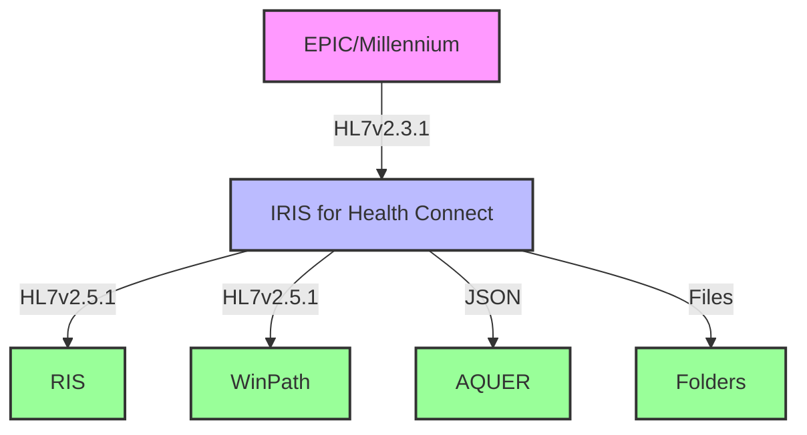
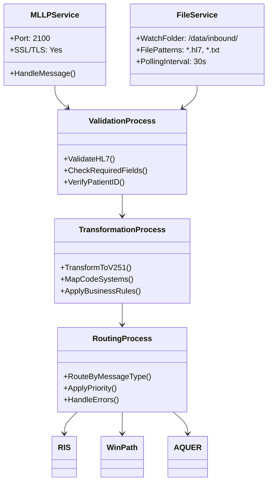

# NHS Trust Integration Engine

## Table of Contents
1. [System Architecture](#1-system-architecture)
   - [High-Level Overview](#11-high-level-architecture)
   - [Component Diagram](#12-component-diagram)
2. [Component Design](#2-component-design)
   - [Inbound Services](#21-inbound-services)
   - [Processing Layer](#22-processing-layer)
   - [Outbound Operations](#23-outbound-operations)
3. [Message Flows](#3-message-flows)
   - [ADT^A01 Example](#31-adt^a01-patient-registration)
   - [ORU^R01 Example](#32-oru^r01-lab-result)
4. [Implementation Plan](#4-implementation-plan)
5. [Code Examples](#5-code-examples)
6. [Deployment](#6-deployment)
7. [Monitoring & Maintenance](#7-monitoring--maintenance)

## 1. System Architecture

### 1.1 High-Level Architecture



### 1.2 Component Diagram



## 2. Component Design

### 2.1 Inbound Services

#### MLLP Service
- **Class**: `BHRUH.Services.MLLP.InboundService`
- **Protocol**: MLLP
- **Port**: 2100 (configurable)
- **Features**:
  - Concurrent connections
  - Message acknowledgment
  - SSL/TLS encryption

#### File Service
- **Class**: `BHRUH.Services.File.InboundService`
- **Watch Folder**: `/data/inbound/`
- **File Patterns**: `*.hl7`, `*.txt`
- **Features**:
  - Configurable polling
  - File archiving
  - Duplicate detection

### 2.2 Processing Layer

#### Validation Process
- **Class**: `BHRUH.Process.ValidationProcess`
- **Validations**:
  - HL7 syntax
  - Required fields
  - Value sets
  - Patient identification

#### Transformation Process
- **Class**: `BHRUH.Process.TransformationProcess`
- **Mappings**:
  - HL7 v2.3.1 → v2.5.1
  - Code system mapping
  - Field transformations

### 2.3 Outbound Operations

| System    | Protocol   | Message Types | Endpoint          |
|-----------|------------|---------------|-------------------|
| RIS       | MLLP       | ORM, ORU      | ris.trust.nhs:4100|
| WinPath   | MLLP/File  | ORU, ORM      | winpath.trust.nhs |
| AQUER     | REST API   | JSON          | api.aquer.nhs.uk  |

## 3. Message Flows

### 3.1 ADT^A01 (Patient Registration)
```hl7
MSH|^~\&|EPIC|BHRUH|IRIS|BHRUH|20230705123456||ADT^A01|MSG00001|P|2.3.1
EVN|A01|20230705123456
PID|1||12345^^^NHS^NH||SMITH^JOHN^P^^MR||19700101|M|||123 MAIN ST^^LONDON^LND^SW1A 1AA^GBR
PV1|1|O|A1^A101^01||||123456^JONES^SARAH^J^^^DR|123456^SMITH^JOHN^A^^^DR|123456^LEE^MARY^K^^^DR
```

### 3.2 ORU^R01 (Lab Result)
```hl7
MSH|^~\&|EPIC|BHRUH|IRIS|BHRUH|20230705123500||ORU^R01|MSG00002|P|2.3.1
PID|1||12345^^^NHS^NH||SMITH^JOHN^P^^MR||19700101|M
OBR|1||12345678^EPC|CBC^COMPLETE BLOOD COUNT^L|||20230705120000
OBX|1|NM|WBC^White Blood Cells|1|7.5|10*3/uL|4.0-11.0|N|||F
```

## 4. Implementation Plan

### Phase 1: Foundation (Weeks 1-2)
- [ ] Set up IRIS for Health environment
- [ ] Implement MLLP and File services
- [ ] Create base processing classes

### Phase 2: Core Processing (Weeks 3-4)
- [ ] Implement validation framework
- [ ] Develop transformation engine
- [ ] Build routing rules engine

### Phase 3: Integration (Weeks 5-6)
- [ ] Implement RIS interface
- [ ] Develop WinPath integration
- [ ] Build AQUER API client

### Phase 4: Testing & Deployment (Weeks 7-8)
- [ ] Unit and integration testing
- [ ] Performance testing
- [ ] UAT and go-live

## 5. Code Examples

### MLLP Service Configuration
```objectscript
Class BHRUH.Services.MLLP.InboundService Extends Ens.BusinessService
{
Parameter ADAPTER = "EnsLib.HL7.Service.TCPService";

Method OnProcessInput(pInput As %RegisteredObject, Output pOutput As %RegisteredObject) As %Status
{
    Set tSC = ..SendRequestAsync("HL7.Router", pInput)
    Quit tSC
}
}
```

### Transformation Process
```objectscript
Class BHRUH.Process.TransformationProcess Extends Ens.BusinessProcess
{
Method OnRequest(pRequest As EnsLib.HL7.Message, Output pResponse As EnsLib.HL7.Message) As %Status
{
    // Transform HL7 v2.3.1 to v2.5.1
    Set tSC = ##class(EnsLib.HL7.Message).Transform(pRequest, .pResponse, "2.5.1")
    Quit:$$$ISERR(tSC) tSC
    
    // Apply code system mappings
    Set tOBXCount = pResponse.GetValueAt("OBX(*)")
    For i=1:1:tOBXCount {
        Set tCode = pResponse.GetValueAt("OBX("_i_").3.1")
        Set tMappedCode = ..MapToLOINC(tCode)
        Set tSC = pResponse.SetValueAt(tMappedCode, "OBX("_i_").3.1")
        Quit:$$$ISERR(tSC)
    }
    Quit tSC
}
}
```

## 6. Deployment

### Prerequisites
- IRIS for Health 2023.1+
- SSL certificates for secure communication
- Network access to source/target systems

### Configuration
1. Update `BHRUH.Production` settings
2. Configure endpoints in `BHRUH.Config`
3. Set up SSL/TLS certificates
4. Deploy business rules

## 7. Monitoring & Maintenance

### Key Metrics
- Message throughput
- Error rates
- Processing times
- Queue depths

### Alerts
- Failed messages
- Queue thresholds
- System resource usage

### Maintenance Tasks
- Daily log rotation
- Weekly archive cleanup
- Monthly performance review
